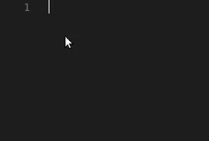

  

<h3 align="left">Connect with me!</h3>

<h3 align="left">My Stack ~</h3>

  
  
  
  
  
  
  
  
  
  
  
  
  
  
  
  
  

#

&nbsp;

##  🐍 &nbsp; Snake

<picture align="center">
  <source media="(prefers-color-scheme: dark)" srcset="https://raw.githubusercontent.com/LuscasArimate/LuscasArimate/output/github-contribution-grid-snake-dark.svg">
  <source media="(prefers-color-scheme: light)" srcset="https://raw.githubusercontent.com/LuscasArimate/LuscasArimate/output/github-contribution-grid-snake-dark.svg">
  
</picture>
